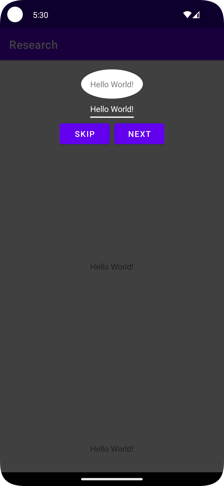
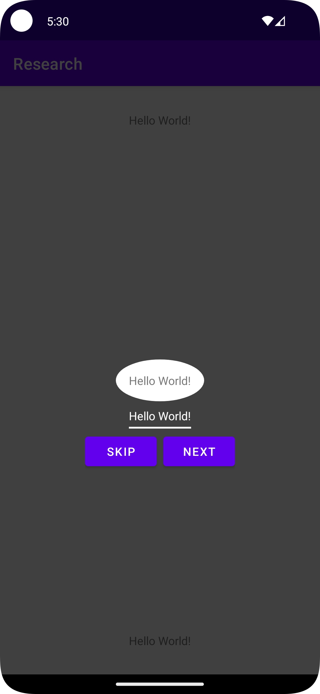
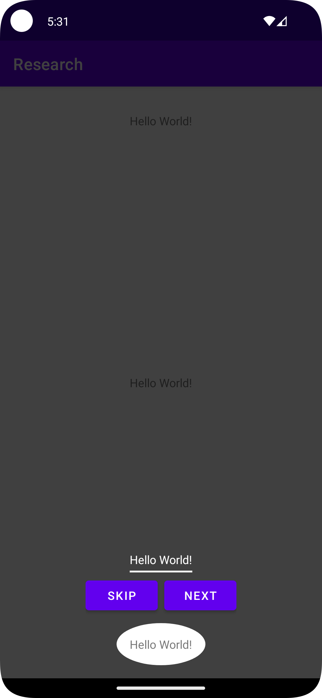

## Coach Mark
- Simple Coach Mark Implementation

## Using Library
- [Balloon](https://github.com/skydoves/Balloon)

## Screenshoot

<table>

<tr>
    <th>Menu 1</th>
    <th>Menu 2</th>
    <th>Menu 3</th>
</tr>

<tr>
    <td></td>
    <td></td>
    <td></td>
</tr>

</table>

## Colaborator
Very open to anyone, I'll write your name under this, please contribute by sending an email to me

- Mail To faisalamircs@gmail.com
- Subject : Github _ [Github-Username-Account] _ [Language] _ [Repository-Name]
- Example : Github_amirisback_kotlin_admob-helper-implementation

Name Of Contribute
- Muhammad Faisal Amir
- Waiting List
- Waiting List

Waiting for your contribute

## Attention !!!
- Please enjoy and don't forget fork and give a star
- Don't Forget Follow My Github Account
